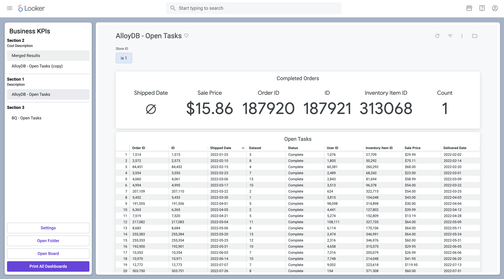

# Dashboard Tabs - Looker Extension

A Looker extension that creates tabbed dashboards with advanced navigation, global filters, and printing. It transforms Looker into a tabbed interface, enabling seamless switching between dashboards while preserving filters and context. Supports folder and board navigation, plus printing functionality.



## Features

### 🎯 Core Functionality

- **Tabbed Dashboard Interface**: Switch between multiple dashboards in a single interface
- **Global Filters**: Apply filters that persist across all dashboards
- **Print All Dashboards**: Generate PDF exports of all configured dashboards
- **Default and Custom Dashboard Tabs**: Configure a list of dashboard IDs to display as tabs, or use folders or boards as the tabs

### 🗂️ Navigation Options

#### Default Dashboard Tabs

- Configure a list of dashboard IDs to display as tabs
- Customizable extension label
- Automatic dashboard loading and switching

#### Folder Navigation

- Browse and navigate through Looker folders
- Access personal and shared folders
- Search functionality for finding specific folders
- Hierarchical folder tree display

#### Board Navigation

- Navigate through Looker boards
- Access favorite boards
- Search and browse all available boards
- Display board sections and dashboard items

### 🖨️ Printing Capabilities

- **Print All Dashboards**: Generate PDF exports of all configured dashboards
- **Filter Preservation**: Maintains current filters when printing

## ⚙️ Settings & Configuration

The extension provides comprehensive settings management through the Settings dialog:

### Basic Configuration

- **Default Extension Label**: Customize the header text
- **Dashboard IDs**: Configure which dashboards appear as tabs
- **Dashboard Search**: Search and add dashboards to the configuration

### Feature Toggles

- **Print All Dashboards**: Enable/turn off the print functionality
- **Enable Folder Navigation**: Show/hide folder navigation button
- **Enable Board Navigation**: Show/hide board navigation button

### Security & Permissions

- **Restrict Settings**: Limit who can modify extension settings
- **Group IDs**: Specify which user groups can update settings
- **Admin Override**: Administrators always have access to settings

## Deployment

### Prerequisites

- Node.js (v18 or higher)
- npm package manager
- Looker instance with extension framework enabled

### Build Process

1. **Install Dependencies**:
   ```bash
   npm install
   ```
2. **Development Mode**:
   ```bash
   # HTTP development server
   npm run dev

   # HTTPS development server (recommended for Looker)
   npm run dev:https
   ```
3. **Production Build**:
   ```bash
   npm run build
   ```

### Manifest Configuration

The extension is configured through an application in your project's `manifest.lkml`:

```lookml
application: dashboard_tabs {
  label: "Dashboard Tabs"
  url: "https://cdn.lkr.dev/apps/dashboard-tabs/latest/bundle.js"
  entitlements: {
    core_api_methods: [
      "me", 
      "dashboard", 
      "search_dashboards", 
      "folder_dashboards", 
      "board", 
      "search_boards", 
      "folder", 
      "search_folders"
    ]
    navigation: yes
    use_embeds: yes
    use_iframes: yes
    new_window: yes
    use_form_submit: yes
  }
  mount_points: {
    standalone: yes
  }
}
```

If developing locally, you can use `url: "https://localhost:8080/bundle.js"`. If you are modifying the extension and don't have access to a CDN, you can run `npm run build` to generate a bundle.js file in the `dist` directory. Drag this file to your Looker project while in dev mode and then use `file: "bundle.js"` in the manifest instead of `url`.

### Required API Permissions

The extension requires the following Looker API methods:

- **User Management**: `me` - Get current user information
- **Dashboard Operations**: `dashboard`, `search_dashboards` - Access dashboard data
- **Folder Operations**: `folder`, `search_folders`, `folder_dashboards` - Navigate folders
- **Board Operations**: `board`, `search_boards` - Access board data

## Usage

### Basic Usage

1. **Access the Extension**: Navigate to the extension in Looker's navigation sidebar under Applications.
2. **Configure Dashboards**: Use Settings to add dashboard IDs as the default dashboards if a board or folder is not selected.
3. **Navigate**: If you turn on folder or board navigation, use the sidebar buttons to switch between tab layouts.
4. **Apply Filters**: Global filters will persist across dashboard switches. Make sure the dashboard has the same filter names to apply them across dashboards.
5. **Print**: If you turn on print functionality, you can print all dashboards at once but turning on the print functionality.

## Contributing

1. Fork the repository
2. Create a feature branch
3. Make your changes
4. Test thoroughly
5. Submit a pull request